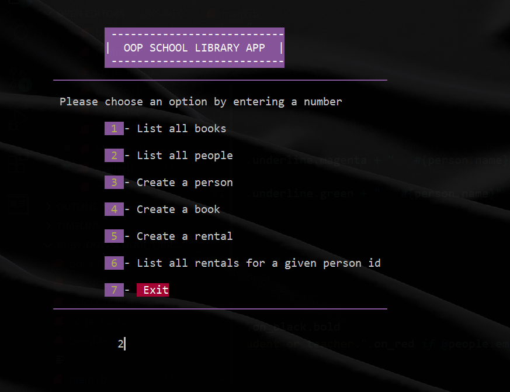
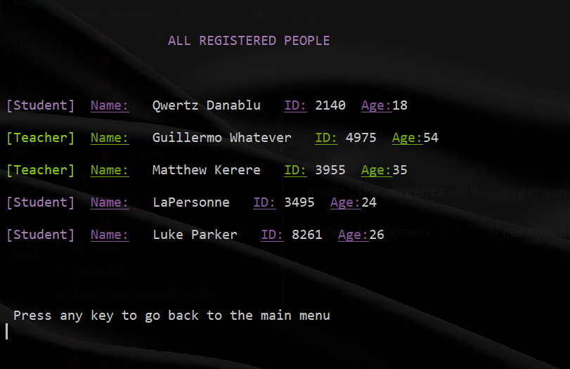

  &nbsp; &nbsp;  

# OOP School Library

## About 

> In this project, I practice OOP (Object Oriented Programming) concepts in Ruby by creating a school library application. 

The project is divided in seven (7) milestones, the current one is **bolded**.

- Milestone 1: Add Person, Student, and Teacher classes
- Milestone 2: Decorate a class
- Milestone 3: Set up associations
- Milestone 4: Add basic UI (console application)
- Milestone 5: Refactor the code
- Milestone 6: Preserve data
- **Milestone 7: Unit tests**

## Screenshots

## Getting started

1. Make sure you have Ruby installed in your system. You can install it [here](https://www.ruby-lang.org/en/documentation/installation/).

2. Clone this repository by running `git clone https://github.com/Kingjosh007/ruby-oop-school-library` in your command line.

3. Navigate to the repository by running `cd ruby-oop-school-library`.

4. Run `ruby main.rb` in your command line.

## Built With

## Author

👤 **King Josaphat Chewa (KJC)**

- GitHub: [@Kingjosh007](https://github.com/Kingjosh007)
- Twitter: [@KingJoChewa](https://twitter.com/KingJoChewa)
- LinkedIn: [LinkedIn](https://www.linkedin.com/in/king-josaphat-chewa/)

## 🤝 Contributing

Contributions, issues, and feature requests are welcome!

Feel free to check the [issues page](../../issues/).

## Show your support

Give a ⭐️ if you like this project!

## Acknowledgments

- Heartfelt thanks to Microverse

## 📝 License

This project is **MIT** licensed.
